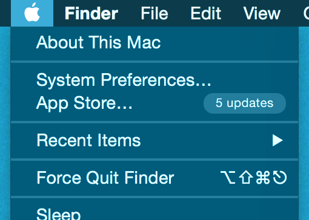
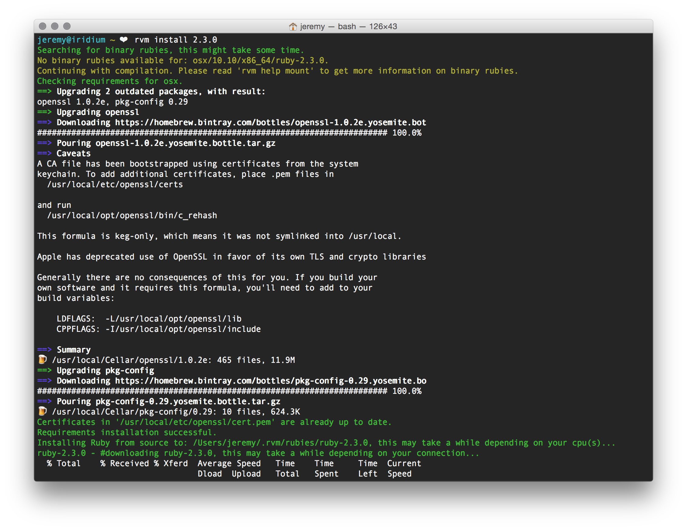

# Installfest! Woo!

Hi! The purpose of these notes is to help you install and configure some software that we'll use to, well, make other software. ^_^ Here's a short list of what we'll be installing. Detailed instructions for each item follow. It is really, really important to install everything in this list. It may feel a little tedious, but getting it done now will set you up for success on day 1 (and day 100!) of class.

## Short list of required software:

- [OS X _El Capitan_ (or OS X _Yosemite_)](http://www.apple.com/osx/whats-new/)
- [Xcode Command Line Tools](#xcode-command-line-tools)
- [Google Chrome (web browser)](https://www.google.com/chrome/browser/desktop/index.html)
- [Atom (text editor)](https://atom.io/)
- [Ruby Version Manager (rvm)](https://rvm.io/)
- [Ruby 2.3.0](https://www.ruby-lang.org/en/)

## Detailed Instructions

### OS X _El Capitan_ or _Yosemite_
_OS X_ is the name of the operating system found on Apple computers. Apple likes to give the versions of their operating systems odd names. They used to be big cats (Cheetah, Puma, Jaguar, Panther, Tiger, Leopard, Snow Leopard, Lion, and Mountain Lion). Now it's... I don't even know. Anyway, the two most recent versions are _Yosemite_ and _El Capitan_. For Ada, your computer must be running one of these two versions of _OS X_, with preference given to _El Capitan_.

To check your version of OS X, click the Apple icon at the far left edge of toolbar at the top of the screen. From there, choose _About This Mac_. That'll open a window with lots and lots of information about your computer. Right at the top, in big type, is the current version of _OS X_.

If your Mac isn't running _Yosemite_ or _El Capitan_, please use the App Store to update. You can open the desktop App Store by going back to the Apple menu and selecting __App Store...__. Operating System upgrades are free, and [Apple's got a detailed guide on updating](http://www.apple.com/osx/how-to-upgrade/).

### Xcode Command Line Tools
_Xcode_ is the name of the collection of software tools used to create programs for _OS X_ and _iOS_ (the operating system on Apple's mobile devices like the iPhone and iPad). We'll need some parts of _Xcode_, but not the whole thing. The part we need is called the _Xcode Command Line Tools_. We won't be using them during the Jumpstart curriculum, but it makes sense to install them now. They can take a long time to download and install, so doing it now will save us lots of time in the classroom later.

We'll use the Terminal to install the _Command Line Tools_. Open Terminal and start the installation by typing `$ xcode-select --install`. Follow the instructions and wait for the installation to finish (Protip: have a snack and maybe go for a walk while it's downloading and installing).

After it finishes, verify the installation by typing `xcode-select -p`. It should respond with something very similar to `/Library/Developer/CommandLineTools` (the directory where they were installed).

### Google Chrome
If you're reading this, you're already using a web browser (software used to access and visualize information on the internet). Unless you've intentionally switched, you're using Apple's web browser, _Safari_. There's nothing wrong with _Safari_; it's a fine browser. However, there are a few things that Google's competing browser, _Chrome_, can do for developers that makes for super fun times in the Ada classroom. You don't have to switch to _Chrome_ for all your day-to-day internet use; I'd just like for you to have it available when we're in class.

To install _Chrome_, download it from [Google's webiste](https://www.google.com/chrome/browser/desktop/index.html). Open the downloaded application package and follow the instructions to complete the installation.

### Atom
Writing software requires software! Way back when, writing software required stacks of [thin balsa wood or cardstock cards](https://en.wikipedia.org/wiki/Punched_card), but these days we use a _text editor_ instead. Word processors are software tools geared towards making composition of prose easier. _Text Editors_ are programs geared towards making code generation easier.

For Ada, we'll use [Atom](https://atom.io/). From the website, download the installer package. Then run the installer. There's not much to _Atom_ out of the box, but it's enough to get us started writing code in the next lesson.

__Note:__ Many folks in the Ruby sphere use either _Atom_ or _Sublime Text_ as their primary editor. Either is fine for the classroom, but if you don't already have _Sublime Text_ or any other _text editor_, go with _Atom_.

### Ruby Version Manager
[Ruby Version Manager (rvm)](https://rvm.io/) makes it easy to install, manage, and switch between Ruby versions. _rvm_ is a _package manager_; it's software to help us install other software. Most _package managers_ are just for installing, updating, and removing software packages, but _rvm_ has a lot of really useful features specifically for working with Ruby that we'll use throughout Ada.

Installing _rvm_ is done in the Terminal: `$ \curl -sSL https://get.rvm.io | bash -s stable`

The installation won't take long. When it's done, close your Terminal (⌘-Q) and then reopen it. Verify all's well by running `$ rvm -v`. You should see something like `rvm 1.26.11 (latest)`.

### Ruby
Finally! Whew! Ruby is the first programming language we'll learn in the classroom. It's also my personal favorite, but that's just a happy accident.

Now that we've got _rvm_ handy, we can install Ruby by typing the following into our terminal: `$ rvm install 2.3.0`

Installing Ruby can take awhile, so feel free to take a break or go for a walk while _rvm_ gets things sorted. In short, _rvm_ will download the ruby version you specified (2.3.0), compile it (prepare it to work specifically on your computer's hardware), install the compiled code in the right place, and do some housekeeping in the (really likely) chance you'll encounter/create code that requires a different Ruby version.

When it's done, you can verify that everything succeeded by typing `$ ruby -v` into your terminal. The return should say something like `ruby 2.3.0p0 (2015-12-25 revision 53290) [x86_64-darwin14]`.

### You did it!
Awesome! Your environment is ready to go! In the next lesson, we'll put that environment to good use and write our first program!
