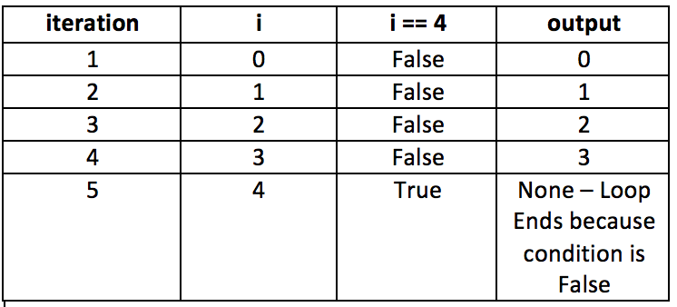

# Notes: Introduction to Loops
Loops are programming constructs that help you repeat a code action an arbitrary number of times without copying and pasting the code. Another term for a **loop** is **iteration**. All high-level programming languages provide various forms of loops, which can be used to execute one or more statements repeatedly.

For example, if we wanted to print out "hello" five hundred times, we could write:
```ruby
puts "hello! "
puts "hello! "
puts "hello! "
puts "hello! "
puts "hello! "
# ... 495 more times
```

Usig a loop, we could re-write this as:
```ruby
500.times do
  puts "hello! "
end
```

There are 2 categories of loops:  **counter-controlled** and **sentinel-controlled** loops

**Counter-controlled** loops are used when the number of loops can be determined prior to loop execution.  For example, a copying machine copies a paper a set number of times, and we know exactly how many times the copier will copy the paper.

**Sentinel-controlled** loops are used when the number of loops cannot be determined prior to loop execution.  For example, if you do jumping jacks until you get tired, it is uncertain how many jumping jacks you will do before stopping.

**There are four types of loops in Ruby that we will start with: `times`, `range-each`, `while`, `until`.**

## Times
You use the `times` iterator to run a block of code `N` times.

You can use a `times` loops with or without an _iteration variable_. This variable is denoted between the vertical bars `|` and is used to store data associated with the iteration.

In the example below, `N` is equal to three. This example _does not_ use an iteration variable.
```ruby
3.times do
  puts "hello! "
end
```
output:
```
hello!
hello!
hello!
```

In the example below, `N` is equal to two. This example _does_ use an iteration variable, `i`, which will correspond to value of the iteration.
```ruby
2.times do |i|
  puts i
end
```
output:
```
1
2
```

## Ranges
The main use of ranges is to express a sequence. Sequences have a start point, an end point, and a way to produce successive values in the sequence.

Ruby creates these sequences using the `..` and `...` range operators. The two-dot form creates an _inclusive_ range, while the three-dot form creates a range that _excludes_ the specified high value. The `each` loop using a range uses an iteration variable, `num` in this example, which will correspond to the

Inclusive
```ruby
(5..9).each do |num|
  puts num
end
```
output
```
5
6
7
8
9
```

Exclusive
```ruby
(5...9).each do |num|
  puts num
end
```
output
```
5
6
7
8
```

## While Loops
The `while` loop is useful when you want to continue doing an action while a certain condition is `true` but you may not know how many times you'll need to complete that action. As soon as the condition stops being true, the loop will terminate.

```ruby
i = 0

while i < 4
  puts i
  i += 1
end
```

The above code will output the values of i until i is no longer less than 4, resulting in the following output:
```
0
1
2
3
```


You can read the condition and execute of the `while` loop as _while condition is **true** do..._

A while loop example:  This loop repeats while the user enters “yes”.
```ruby
again = "yes"

while again == "yes"
  puts "Let's play a game!"
  puts "..."
  puts "Would you like to play again? (yes/no) > "
  again = gets.chomp
end
```


## Until Loops
The `until` loop acts as an inverse of the `while` loop. The loop will execute _until_ the condition evaluates as `true`.


```ruby
i = 0

until i == 4
   puts i
   i += 1
end
```

The above code will output the values of i until i is equal to 4, resulting in the following (equivalent to the `while` loop) output:
```
0
1
2
3
```



You can read the condition and execute of the `until` loop as _until condition is **true** do..._

An until loop example: This loop will repeat until the user guesses the number 6.

```ruby
game_over = false
number = 0

until number == 6
  puts "Guess my number (1-10) > "
  number = gets.chomp.to_i
end

puts "You guessed it!"
```
